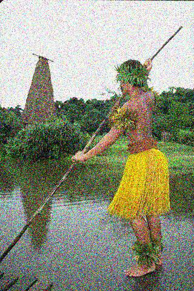
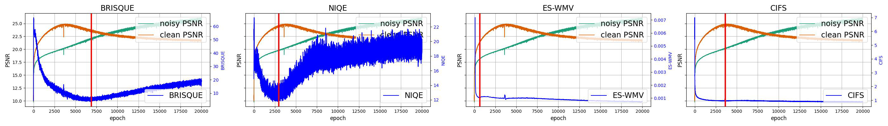
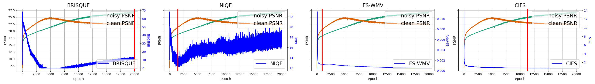
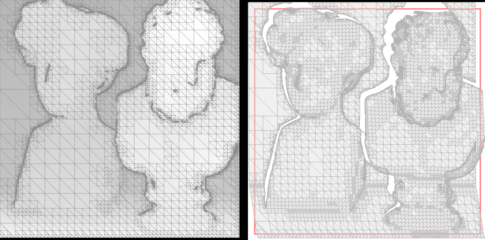
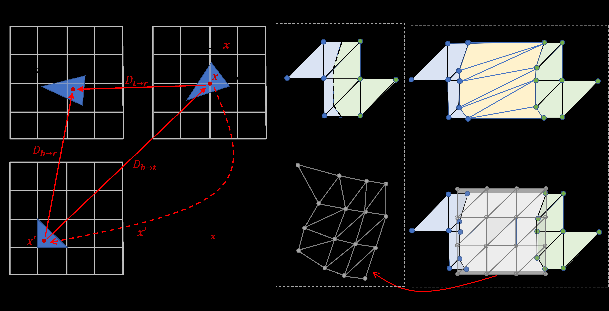
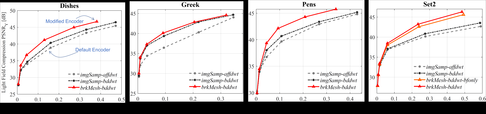
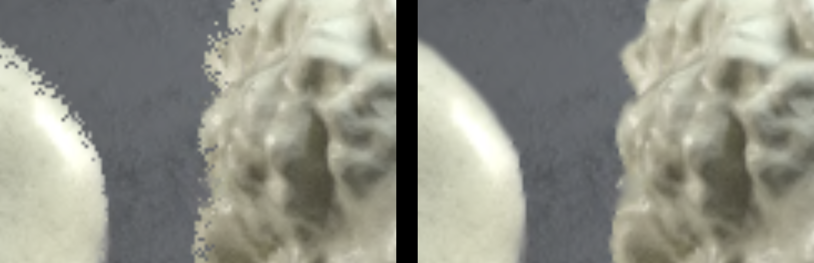

# 종합 보고서

## (1) 전체 종합 요약

**Field Context and Overarching Themes**

All three papers converge on the emerging trend of *JPEG‑centric* solutions that reconcile legacy compression standards with modern vision tasks. While the first two focus on **deep‑learning inference and image restoration**, the third tackles **light‑field coding**—a domain where JPEG’s 4DPM framework is already entrenched. The unifying theme is the exploitation of **frequency‑domain properties** (DCT, wavelets) and **perceptual cues** to drive compression decisions that are *task‑aware* rather than purely human‑centric.

---

### 1. JPEG‑Compliant Compression for DNN Vision

**Key Methods & Trends**

- **Sensitivity‑Weighted Error (SWE)**: A theoretically grounded metric that replaces MSE in the JPEG rate–distortion objective. SWE aggregates squared gradients of the DNN loss with respect to each DCT coefficient, yielding a per‑frequency sensitivity score.
- **OptS Quantization‑Table Optimizer**: An offline, model‑agnostic procedure that minimizes bitrate under a SWE distortion budget while preserving the standard JPEG pipeline (shared chrominance tables, 8×8 DCT blocks).
- **Model‑agnostic Evaluation**: Tested on ResNet‑50 and MobileNetV2 across ImageNet, demonstrating that a single optimized table can generalize to multiple architectures.

**Consensus Findings**

- SWE‑based quantization consistently outperforms both standard JPEG and MSE‑optimized alternatives, achieving >50 % bitrate savings for ResNet‑50 with negligible accuracy loss.
- The approach is computationally lightweight (offline optimization only) and fully compatible with existing JPEG decoders.

**Points of Disagreement / Open Questions**

- Sensitivity estimation relies on a representative image set; its robustness to domain shift (e.g., medical imaging) remains untested.
- The method assumes a static DNN; dynamic models (e.g., continual learning) may require re‑optimization.

**Notable Gaps & Future Directions**

- Extending SWE to *multi‑task* networks (e.g., joint detection–segmentation) where loss components differ.
- Investigating *online* sensitivity estimation that adapts to streaming data or model updates.

---

### 2. JPEG Information Regularized Deep Image Prior for Denoising

**Key Methods & Trends**

- **Compressed Image File Size (CIFS) as Early‑Stopping Criterion**:

## (2) 논문 간 유사성/차별성

### 유사도 상위 페어
| Paper A | Paper B | Similarity |
|---|---|---:|
| jpeg-compliant-compression-for-dnn-vision | jpeg-information-regularized-deep-image-prior-for-denoising | 0.241 |
| jpeg-compliant-compression-for-dnn-vision | jpeg-pleno-light-field-encoder-with-mesh-based-view-warping | 0.203 |
| jpeg-information-regularized-deep-image-prior-for-denoising | jpeg-pleno-light-field-encoder-with-mesh-based-view-warping | 0.194 |

### 클러스터 결과
- Cluster 2: jpeg-compliant-compression-for-dnn-vision
- Cluster 1: jpeg-information-regularized-deep-image-prior-for-denoising
- Cluster 0: jpeg-pleno-light-field-encoder-with-mesh-based-view-warping

## (3) 논문별 개별 요약

### JPEG Compliant Compression for DNN Vision (jpeg-compliant-compression-for-dnn-vision)

- 원본: `sample_data/JPEG_Compliant_Compression_for_DNN_Vision.pdf`
- 페이지 수: 5
- 발행일: D:20230816163404-04'00'

추출 이미지: 없음

요약:

**Problem**  
Standard JPEG compression is engineered to minimize perceptual distortion for human viewers, but deep neural networks (DNNs) exhibit a markedly different sensitivity to frequency‑domain errors. Quantization noise that is visually innocuous can substantially degrade classification accuracy, while existing deep‑learning‑oriented compression (DOC) schemes either fail to beat conventional JPEG in the rate–accuracy trade‑off or incur prohibitive computational overhead. The paper therefore seeks a JPEG‑compatible compression strategy that explicitly optimizes for DNN inference performance rather than human perception.

**Method**  
The authors introduce the *Sensitivity‑Weighted Error* (SWE) metric, derived from a theoretical upper bound on loss increase due to perturbing discrete cosine transform (DCT) coefficients. For each DCT frequency \(i\), a sensitivity score  
\(s_i=\sum_j(\partial L/\partial C_{i,j})^2\)  
is estimated offline by back‑propagating through a pre‑trained DNN on a representative image set. SWE replaces mean‑squared error (MSE) in the JPEG rate–distortion objective, weighting coefficient errors by their estimated impact on the DNN loss. Using SWE, the authors formulate **OptS**, a quantization‑table optimization that minimizes bitrate under a SWE distortion budget while preserving the standard JPEG pipeline (including shared chrominance tables). OptS is applied to both grayscale and color images, with a two‑channel chrominance optimizer that respects JPEG’s quantization constraints.

**Data**  
Experiments are conducted on the ImageNet validation set using two state‑of‑the‑art classifiers: ResNet‑50 and MobileNetV2. Sensitivity estimation is performed on 10 K training images, after which the optimized tables are evaluated on the full validation set. Bits per pixel (bpp) versus top‑1 accuracy curves are generated for standard JPEG, the baseline MSE‑based OptD, and the proposed SWE‑based OptS.

**Results**  
OptS consistently outperforms both JPEG and OptD across all tested models. For ResNet‑50, OptS achieves a 57.4 % reduction in bpp while maintaining accuracy within 0.1 % of the uncompressed baseline; for MobileNetV2, it attains an 8.3× compression ratio with only a 0.47 % accuracy loss, or

### JPEG Information Regularized Deep Image Prior for Denoising (jpeg-information-regularized-deep-image-prior-for-denoising)

- 원본: `sample_data/JPEG_Information_Regularized_Deep_Image_Prior_for_Denoising.pdf`
- 페이지 수: 5
- 발행일: D:20230816222943-04'00'

대표 이미지 (최대 4장):

요약:

**Problem**  
Deep Image Prior (DIP) can overfit a noisy observation, reconstructing the noise rather than the underlying clean image. Existing early‑stopping (ES) strategies rely on data‑specific heuristics, such as SURE or visual inspection, and often require knowledge of the noise statistics. Consequently, selecting a stopping point that generalizes across noise levels and datasets remains an open challenge.

**Method**  
The authors introduce a data‑agnostic ES criterion based on the *Compressed Image File Size* (CIFS) of a JPEG‑encoded intermediate reconstruction. Because JPEG compression is optimized for natural images, its file size grows monotonically with added Gaussian noise. During DIP training the network minimizes a weighted sum of the reconstruction loss \(L\) and a regularizer \(R(C(f_{\theta}(z)))\), where \(C(\cdot)\) returns the JPEG file size and \(R(L)=L^{2}/(HW)\). The balancing weight \(\lambda\) is empirically linked to the noise level, estimated from synthetic Gaussian experiments on a clean image set. Training is halted when CIFS ceases to decrease within a sliding window, ensuring that further optimization would only increase residual noise.

**Data**  
Experiments were performed on standard denoising benchmarks: CBSD500 (for λ estimation), CBSD68, and Kodak24. Synthetic additive Gaussian noise with \(\sigma\in\{5,\dots ,75\}\) and Poisson noise were injected. Performance was measured in PSNR (and SSIM for qualitative comparison) against ground‑truth clean images. The method was compared to state‑of‑the‑art ES baselines (SURE, Poisson‑aware DIP, Self‑validation, ES‑WMV) and non‑reference IQA metrics (BRISQUE, NIQE).

**Results**  
CIFS‑based ES consistently matched or surpassed the best PSNRs achieved by existing ES strategies across all noise levels. For example, on CBSD68 with \(\sigma=15\) the peak PSNR increased from 30.46 dB (ES‑WMV) to 31.26 dB, and on Kodak24 with \(\sigma=25\) it rose from 29.04 dB to 31.58 dB. The method also reduced the PSNR gap between low and high noise regimes,

### JPEG Pleno Light Field Encoder with Mesh based View Warping (jpeg-pleno-light-field-encoder-with-mesh-based-view-warping)

- 원본: `sample_data/JPEG_Pleno_Light_Field_Encoder_with_Mesh_based_View_Warping.pdf`
- 페이지 수: 5
- 발행일: D:20230816182218-04'00'

대표 이미지 (최대 4장):

요약:

**Problem**  
The JPEG Pleno light‑field encoder relies on forward warping and splatting of reference textures, which produces excessive smoothing and holes at depth discontinuities. Depth is coded only for a sparse set of views using standard JPEG 2000, so disparity inference for the remaining views is inaccurate and dis‑occluded regions are poorly handled. Existing mesh‑based view‑warping studies have focused on synthesis only and do not exploit depth from multiple views, limiting the quality of novel‑view reconstruction.

**Method**  
The authors replace the default pipeline with a joint depth–texture coding and warping strategy:

1. **Depth Coding** – JPEG 2000 Part 17 breakpoint‑dependent DWT (BD‑DWT) is used to encode depth maps. The BD‑DWT adapts the lifting steps locally, preserving piece‑wise smooth structure and explicitly marking depth discontinuities (breakpoints).  
2. **Mesh Construction** – BD‑DWT coefficients are decoded directly onto a hierarchical triangular mesh. Progressive subdivision is driven by non‑zero wavelet coefficients and the newly identified breakpoints, yielding a piece‑wise continuous depth mesh.  
3. **Backward Warping** – The mesh is used for invertible backward texture warping, replacing the standard forward approach. Each triangle is affinely projected to all target views; occlusions are resolved by selecting the nearest triangle in depth.  
4. **Mesh Augmentation & Fusion** – When multiple depth maps are available (e.g., from a dense camera array), the base mesh is augmented with additional layers derived from those maps. Triangles that intersect dis‑occluded regions in a target view are warped back to the base view, forming new layers that expand in other views. This layered mesh ensures consistent handling of newly visible geometry.

**Data**  
Experiments were performed on several benchmark light‑field datasets: Greek, Dishes, Pens, and the high‑density Set 2 array. Depth maps were encoded with BD‑DWT; reference views were intra‑coded using the JPEG Pleno 4DPM framework. Encodings were evaluated at multiple hierarchical levels and bitrates (0.04–0.17 bpp).

**Results**  
Rate‑distortion curves show consistent gains over the default JPEG Pleno encoder (imgSamp‑affdwt). The combined brkMesh‑bddwt configuration outperforms
